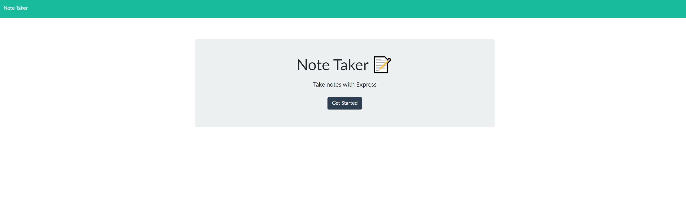

<h5>Rutgers Coding Bootcamp</h5>
<h1 align="center">Express Note Taker Application</h1>

By Dylan Gough

<h2>What is this?</h2>

Created an application that can be used to write, save, and delete notes. This application will use an express backend and save and retrieve note data from a JSON file.

 

<h2>Components</h2>

HTML | JavaScript | Node.JS | Express

 

<h2>Install Process</h2>
* npm install express
* npm install node

 

<h3 align="right"><a href="https://github.com/dylangough/Express-Note-Taker">Github Link</a></h3>